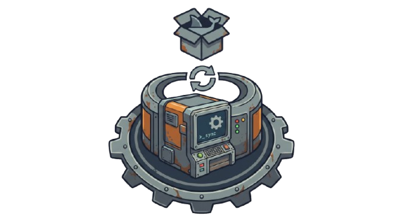

# WorkersAdmon ⚙️

Contenedor Docker **`workersadmon`** con los workers de fondo de ECCSA y la
página de estado de los mismos. **Separado por completo de `field`, `admon` y
`hub_python`** — su propio repo, su propia imagen, su propia red y sus propios
volúmenes.

> **Estado actual: SIN WORKERS ACTIVOS.**
> Solo corre `status_web` (el **panel de control**). Los 10 programas de
> `docker/conf.d.available/` están *en standby*: el código está en la imagen,
> pero ninguno está habilitado. Se activan uno a uno **desde el panel** o con
> `enable_worker`.

---

## 1. Qué corre dentro

| Programa | Estado | Origen |
|---|---|---|
| `status_web` | ✅ siempre activo | `docker/conf.d/status_web.conf` |
| `bing_worker`, `tipo_cambio_worker`, `telegram_worker`, `oxxogas_worker`, `oxxogas_contactos_worker`, `pdf_storage_worker`, `network_scanner_worker`, `vales_worker`, `govale_vouchers_worker` | ⏸️ standby | `docker/conf.d.available/*.conf` (origen: HUB) |
| `mcp_server` (passkeys + push + MCP, puerto 8000) | ⏸️ standby | `docker/conf.d.available/mcp_server.conf` |

---

## 2. Construir y levantar (ServerVM)

```bat
:: 1) subir el código (en este sandbox: tar + scp; en tu equipo: git clone)
tar -czf WorkersAdmon.tar.gz -C WorkersAdmon .
scp WorkersAdmon.tar.gz eccsa@10.188.141.31:C:/WorkersAdmon.tar.gz
ssh eccsa@10.188.141.31 "if not exist C:\WorkersAdmon mkdir C:\WorkersAdmon & tar -xzf C:\WorkersAdmon.tar.gz -C C:\WorkersAdmon"

:: 2) build DESACOPLADO (Windows mata los procesos al cerrar el SSH, por eso
::    se lanza con el Programador de Tareas y se vigila el log)
ssh eccsa@10.188.141.31 "schtasks /create /tn WorkersBuild /tr C:\WorkersAdmon\deploy\build.bat /sc once /st 23:59 /f & schtasks /run /tn WorkersBuild"
::   → esperar hasta que C:\WorkersAdmon\build.log diga "FIN rc=0"
::   (build con WITH_PLAYWRIGHT=1 solo cuando actives el primer worker de navegador:
::    docker build --build-arg WITH_PLAYWRIGHT=1 -t workersadmon .)

:: 3) red dedicada (una sola vez) + levantar el contenedor
ssh eccsa@10.188.141.31 "powershell -ExecutionPolicy Bypass -File C:\WorkersAdmon\deploy\run_container.ps1"
```

`deploy/run_container.ps1` toma las credenciales de **`hub_python`**
(`/app/secretos_local.py`), las pasa en un `--env-file` temporal que **borra al
terminar**, crea la red `workersadmon_net` si no existe y levanta el contenedor
con `--restart unless-stopped` (0 workers activos: solo el panel).

| Elemento | Valor |
|---|---|
| Panel de control | `http://10.188.141.31:8200/` (login con tu cuenta del HUB) |
| API JSON | `http://10.188.141.31:8200/api/status` |
| Sondeo | `http://10.188.141.31:8200/healthz` |
| Puerto publicado | **solo 8200** (nada más queda expuesto) |
| Volumen | `workersadmon_data` → `/data` (lista de habilitados + heartbeats) |
| Red | `workersadmon_net` (aislada de `hub_default`) |

> Las credenciales se generan en `/app/secretos_local.py` **al arrancar**, desde
> las variables de entorno. Nunca se suben a Git.

---

## 3. Panel de control (interfaz web)

`status_server.py` monta el paquete `panel/`: una interfaz web (stdlib, sin
dependencias) para controlar workers y — en las fases siguientes — la
configuración y notificaciones de todo el ecosistema.

### Acceso

* Login con **tu cuenta del HUB** (correo `@ecc-ssa.com.mx` + contraseña):
  valida contra `HUB_Users` y crea la sesión en **`HUB_Sessions`** (mismo
  mecanismo y misma cookie `ecsa_token` que el HUB).
* **Login con passkey** (WebAuthn): el formulario trae el botón «🔐 Entrar con
  passkey» (solo se muestra si el navegador lo soporta y la página está en
  `https://worker.ecc-sa.com.mx`). **No registra credenciales**: usa las que ya
  creaste en HUB/Field (`HUB_Passkeys`, rp raíz `ecc-sa.com.mx`) y solo verifica.
  Las passkeys heredadas de `field.`/`hub.` **no sirven aquí** (el navegador
  exige que `rpId` sea dominio registrable) y se rechazan con un mensaje claro.
* Se requiere el permiso **`AccesoConfiguracion`**; sin él la página muestra
  "acceso denegado".
* Protecciones: cookie `HttpOnly` + `SameSite=Lax` (y `Secure` cuando la petición
  llega por `https` vía Cloudflare), token **CSRF de doble envío** en todos los
  POST, límite de 5 intentos fallidos por IP (1 min de bloqueo) y bitácora en
  `HUB_ActivityLog` (login, acciones, logout).

### PWA (instalable)

* Mismo patrón que **Field** y **Admon**: `static/manifest.webmanifest`,
  `static/sw.js` y `static/icons/*`, servidos en la raíz del sitio.
* Los `<meta>`/`<link>` de instalación y el registro del SW viven en
  `panel/templates.py` (`PWA_HEAD`, `PWA_JS`) y se inyectan en **todas** las
  páginas (panel, login y `forbidden`).
* `sw.js` obedece la regla dura de Field: **solo intercepta GET**. Las
  navegaciones van siempre a red (sin cachear HTML autenticado) y sin conexión
  sirve `/offline`; `/api/status`, `/healthz`, `/login` y `/passkey/*` son
  network-only.
* Instalable desde `https://worker.ecc-sa.com.mx` (el navegador exige HTTPS;
  en `http://10.188.141.31:8200` no aparece el banner de instalación).

### Móvil (teléfonos y tabletas)

* La UI es responsive a dos cortes: **820px** (tablet/celular) y **430px**
  (celular angosto), definidos en `panel/templates.py → CSS`.
* **Tablas** dentro de `<div class="tscroll">`: en pantallas angostas se
  desplazan horizontalmente en vez de comprimir columnas; las columnas menos
  importantes usan la clase `hide-sm`.
* **Objetivos táctiles ≥40px** (botones/pestañas), inputs a **16px** para que
  iOS no haga zoom automático al enfocar, y `safe-area-inset-*` para el notch
  (ya que el viewport trae `viewport-fit=cover`).
* Cabecera compacta en móvil: logo más pequeño y sin el «· panel de control».

### Pestañas

| Pestaña | Estado | Contenido |
|---|---|---|
| 🔧 **Workers** | ✅ Fase A | Estado + **Activar / Deshabilitar / Reiniciar** + ver **logs** |
| ⚙️ **Configuración** | ✅ Fase B | **Config editable de cada worker** (entorno + `HUB_Config` + constantes) |
| 🔔 **Notificaciones** | ✅ Fase C | **Telegram, Push, SMTP e IA** con pruebas de envío y permisos por bloque |
| ⚙️ **Apps** | ✅ Fase D | **Catálogo de claves de config por app** (HUB, admon, Field, futuras) con alta, edición y valores en vivo |

### Pestaña Workers

Tema oscuro ECCSA, se recarga sola cada 15 s, y muestra por programa:

* **Estado** real de supervisord (● EN EJECUCIÓN / ■ DETENIDO / ▲ FALLO / ○ NO HABILITADO)
* **Habilitado** — si está en la lista persistente `/data/workers_enabled.txt`
* **Activo desde** — fecha/hora del último arranque del proceso (+ hace cuánto)
* **Última ejecución** — heartbeat reportado por el worker (+ hace cuánto)
* **Detalle** — texto libre y conteo que manda el worker
* **Acciones** — los mismos caminos que los scripts CLI (`enable_worker` /
  `disable_worker` / `supervisorctl restart`). `status_web` (el panel) es
  inmutable desde su propia interfaz.
* **Logs** — últimas 300 líneas de `/var/log/supervisor/<nombre>.log`
* **⚙️ Config** — acceso directo a la pestaña de configuración de ese worker
* **ℹ️ Qué hace** — párrafo plegado con el trabajo real del worker (mismo texto
  que se muestra completo en su tarjeta de Configuración; fuente: los
  docstrings de cada script en este repo). El texto vive en
  `panel/workers.py` → `CATALOGO[nombre]["descripcion"]`.

### Qué hace cada worker

| Worker | Qué hace |
|---|---|
| `status_web` | Este panel: HTTP con el módulo estándar de Python (8080 interno → 8200 host). Login con cuenta del HUB, tabla de estado, logs y configuración; solo toca SQL para login, sesión, bitácora y `HUB_Config`. |
| `tipo_cambio_worker` | Cada mañana consulta el dólar FIX de Banxico (SF51158) con fallback a `open.er-api.com` y guarda `HUB_Config.tipo_cambio_usd`, que leen Cotizaciones, Órdenes de Compra y el Dashboard. |
| `bing_worker` | Descarga los wallpapers de Bing y rota los últimos N en `HUB_BingWallpapers`; la app solo lee el activo con `bing_wallpaper.get_active_background()`. |
| `oxxogas_contactos_worker` | Con Playwright refresca el caché de empresas/contactos de Go Vale usado como catálogo al registrar vales (credenciales `govale_*`, imagen con Playwright). |
| `network_scanner_worker` | Procesa los ARP scan de la subred, detecta entradas/salidas con N escaneos consecutivos, filtra MACs multicast, marca IPs ZeroTier, limpia escaneos de más de 7 días y alerta por Telegram. |
| `telegram_worker` | Consume `HUB_TelegramQueue` cada 20 s: atiende `/start`, envía texto o adjunto, reintenta máximo 3 veces y limpia historial de más de 30 días. |
| `pdf_storage_worker` | A las 3:00 AM regenera los PDFs del día anterior de los 5 módulos (Materiales, CSP, Reportes, OC, Remisiones) y los sube al Fileserver con `smbclient`; fecha en `HUB_Config.pdf_worker_last_run`. |
| `oxxogas_worker` | Cada hora revisa la IMAP de cada usuario con `AccesoValesOxxoGas` y sincroniza los correos de vales (búsqueda `SINCE` + `Message-ID`); última sync en `HUB_GmailTokens.LastSyncTime`. |
| `vales_worker` | Cada 5 min busca vales `APROBADO` sin `CodigoQR` (p. ej. los aprobados desde Field) y los genera en Go Vale con Playwright, guardando el QR. |
| `govale_vouchers_worker` | Cada 5 min hace login en Go Vale, extrae los vales nuevos desde el último sync, genera su imagen QR (`qrcode`) y los vincula con las solicitudes pendientes del HUB. |
| `mcp_server` | Servidor MCP en el 8000 del host: `run_command` / `write_file` / `read_file`, reto de passkeys (JWT) y push VAPID; lo consumen Field y las integraciones (`http://ServerVM:8000/message`). |

### Pestaña Configuración

Un catálogo por worker (`panel/spec.py`) con **todo lo necesario para
editarlo**, marcando el **origen** de cada valor:

| Etiqueta | Origen | Efecto al guardar |
|---|---|---|
| `ENTORNO` | variable de entorno del `.conf` (`CRON_*`, `HUB_JWT_SECRET`) | Se parchea `docker/conf.d.available/<worker>.conf` **y** el conf activo, `supervisorctl reread + update` (reinicia si estaba corriendo) y se persiste en **`/data/worker_env.json`** → el **entrypoint la reaplica en cada arranque** (sobrevive a un rebuild de la imagen) |
| `HUB_CONFIG` | tabla `HUB_Config` en SQL Server | Upsert (mismo `MERGE` que el HUB); los workers la leen en cada ciclo → **aplica de inmediato, sin reiniciar** |
| `CÓDIGO` | constante del worker | **Solo lectura**: la fuente de verdad es el repo HUB |
| `INFO` | nota | Solo lectura |

Reglas de seguridad: los **secretos nunca viajan al navegador** (campo en
blanco = *no cambiar*), no se registran en la bitácora ni en el mensaje flash
(solo el nombre del campo), los números validan rango y `HUB_Config.Valor`
respeta su límite de 500 caracteres. La pestaña está bajo el mismo permiso
`AccesoConfiguracion`.

Acciones: `GET /configuracion`, `POST /configuracion/<worker>` y
`POST /configuracion/telegram_worker/probar` (getMe sin exponer el token).

JSON completo en `/api/status` (mismos datos, sin secretos, para monitoreo).

### Pestaña Notificaciones

Cuatro bloques, cada uno con **su permiso del HUB** y su botón de prueba:

| Bloque | Permiso | Qué administra | Prueba |
|---|---|---|---|
| 🔔 **Telegram** | `AccesoTelegram` | **5 sub-pestañas como en el HUB** (`views/telegram.py`): 🔌 Conexión (token `HUB_Config.telegram_bot_token` + instrucciones), ⚙️ Eventos (plantillas `HUB_TelegramEventos`), 👥 Destinatarios (**resumen con chips** de quién recibe cada evento + checklist por tarjeta, `HUB_TelegramDestinatarios`), 🔗 Vinculados (tabla + alta/desvinculación manual) y 📋 Historial (cola `HUB_TelegramQueue`, limpieza >30 días) | `getMe` de la API |
| 🔔 **Push** | `AccesoConfiguracion` | Claves VAPID (`HUB_PushConfig`) + nº de suscriptores | envía un push a todas las suscripciones (borra las caducadas 404/410) |
| 📧 **Correo SMTP** | `AccesoConfigurarCorreo` | Servidor, puerto, usuario, contraseña y flags SSL/TLS/auth (`HUB_EmailConfig`) | envía un correo de prueba a la dirección que indiques |
| 🤖 **IA** | `AccesoConfigAI` | Provider, API key y modelo (`HUB_AIConfig`) | lista los modelos de Gemini (1 sola llamada) |

Reglas: los **secretos jamás se pintan en el HTML** ni en la bitácora (blanco =
*no cambiar*), los eventos/destinatarios se escriben en **las mismas tablas que
el HUB** (aplican al próximo disparo, sin reiniciar) y las sondas de red viven
en **`panel/probes.py`** (Telegram en `panel/workers.test_telegram_bot`).

Acciones: `GET /notificaciones[?tg=<vista>]` (sub-pestaña Telegram:
`conexion|eventos|destinatarios|vinculados|historial`; por defecto `conexion`),
`POST /notificaciones/<bloque>` (guardar),
`POST /notificaciones/<bloque>/{probar|evento|destinatarios}` y
`POST /notificaciones/telegram/{vincular|desvincular|limpiar}`.

### Pestaña Apps

Catálogo **por aplicación** de todo lo configurable del ecosistema: los
**metadatos** (app, título, tipo, unidad, orden, descripción) viven en
`HUB_ConfigCatalogo` y el **valor** sigue en `HUB_Config`, así que lo que
guardas aquí lo lee al instante HUB, Field o admon (sin reiniciar).

| Bloque | Qué hace |
|---|---|
| 🗂️ **App** | Una tarjeta por app con sus claves: **título, valor, tipo y descripción** editables. 💾 guarda solo esa fila, `💾 Guardar valores` guarda todas las de la app y 🗑️ solo quita la fila del catálogo (**el valor en `HUB_Config` se conserva**) |
| 🔑 **Sin clasificar** | Claves que ya existen en `HUB_Config` pero todavía no están catalogadas. No muestran su valor (pueden ser secretas); con **📁 Clasificar** pasan al catálogo de la app que indiques |
| ➕ **Nueva clave** | Alta de una clave nueva (y de la app si no existe), con valor inicial opcional |

Tipos de valor: `text`, `secret`, `number`, `bool` y `readonly` (solo
lectura, p. ej. `tipo_cambio_usd` que escribe el worker). Reglas: los
**secretos jamás se pintan** (campo en blanco = *no cambiar*), la **clave es
global** (`HUB_Config.Clave` es la PK: una clave pertenece a UNA sola app),
los cambios quedan en la bitácora **sin valores**, y si la tabla aún no
existe la página avisa con el comando para aplicar la migración
`0036_config_catalogo.sql`.

Permisos: **`AccesoAppConfig`** (sin él la pestaña sale gris en la barra y
`/apps` responde 403).

Acciones: `GET /apps` y `POST /apps` con un solo formulario por bloque; los
botones se distinguen por su `name` (`save_all`, `edit`, `del`, `add`,
`clasificar`).

### Endpoints

| Método | Ruta | Auth | Descripción |
|---|---|---|---|
| GET | `/healthz` | no | sondeo `"ok"` |
| GET | `/api/status` | no | estado JSON |
| GET/POST | `/login` | no | formulario (contraseña + passkey) y creación de sesión |
| POST | `/passkey/begin` | no (CSRF) | options + `state` firmado del challenge (JSON) |
| POST | `/passkey/finish` | no (CSRF) | verifica la passkey y crea la sesión (JSON) |
| POST | `/logout` | sesión | cierra la sesión |
| GET | `/` | sesión | pestaña Workers |
| GET | `/configuracion` | sesión | pestaña Configuración |
| POST | `/configuracion/<worker>` | sesión + CSRF | guarda env + `HUB_Config` |
| POST | `/configuracion/<worker>/probar` | sesión + CSRF | prueba (token Telegram) |
| GET | `/workers/<n>/logs` | sesión | logs de un programa |
| POST | `/workers/<n>/enable\|disable\|restart` | sesión + CSRF | acción + redirect |
| GET | `/notificaciones[?tg=...]` | sesión | Notificaciones (sub-pestaña Telegram) |
| POST | `/notificaciones/<bloque>` | sesión + CSRF | guardar bloque (`telegram\|push\|correo\|ia`) |
| POST | `/notificaciones/<bloque>/probar` | sesión + CSRF | sonda de red (token, push, correo, IA) |
| POST | `/notificaciones/telegram/evento` | sesión + CSRF | plantilla/adjunto/activo de un evento |
| POST | `/notificaciones/telegram/destinatarios` | sesión + CSRF | destinatarios de un evento (multiselect) |
| POST | `/notificaciones/telegram/vincular` | sesión + CSRF | vincula un usuario con su chat_id |
| POST | `/notificaciones/telegram/desvincular` | sesión + CSRF | quita la vinculación |
| POST | `/notificaciones/telegram/limpiar` | sesión + CSRF | borra la cola >30 días |
| GET | `/apps` | sesión + `AccesoAppConfig` | pestaña Apps (catálogo por app) |
| POST | `/apps` | sesión + CSRF + `AccesoAppConfig` | alta / editar / borrar / guardar valores / clasificar |
| GET | `/manifest.webmanifest` | no | manifiesto PWA (instalable) |
| GET | `/sw.js` | no | service worker (solo GET, `no-cache`) |
| GET | `/offline` | no | página estática que sirve el SW sin conexión |
| GET | `/icons/<nombre>.png` | no | iconos PWA (whitelist, 120–512 + maskable) |

---

## 4. Activar / desactivar workers

```bat
:: ver qué hay disponible, habilitado y su estado
docker exec workersadmon workers_list

:: activar uno (lo agrega a /data/workers_enabled.txt y lo arranca ya)
docker exec workersadmon enable_worker tipo_cambio_worker

:: desactivarlo (lo detiene y lo quita de la lista)
docker exec workersadmon disable_worker tipo_cambio_worker
```

La lista vive en el **volumen** → si recreas el contenedor, el entrypoint vuelve
a levantar exactamente los mismos workers.

---

## 5. Agregar un worker nuevo

1. **Código** — crear `mi_worker.py` en la raíz del repo.
2. **Conf** — crear `docker/conf.d.available/mi_worker.conf`:
   ```ini
   [program:mi_worker]
   command=/usr/local/bin/python3.11 -u /app/mi_worker.py
   directory=/app
   autostart=true
   autorestart=true
   redirect_stderr=true
   stdout_logfile=/var/log/supervisor/mi_worker.log
   stdout_logfile_maxbytes=10MB
   stopasgroup=true
   killasgroup=true
   ```
3. **Heartbeat** — dentro del loop, reportar la última ejecución:
   ```python
   from worker_heartbeat import heartbeat
   heartbeat("mi_worker", detail="12 registros procesados", count=12)
   ```
4. **Build** (si el contenedor ya existe, basta con subir los archivos):
   ```bat
   docker build -t workersadmon . 
   docker rm -f workersadmon && docker run -d ... (mismo comando del §2)
   :: o en caliente, sin recrear:
   docker cp mi_worker.py workersadmon:/app/
   docker cp docker\conf.d.available\mi_worker.conf workersadmon:/app/docker/conf.d.available/
   docker exec workersadmon enable_worker mi_worker
   ```
5. **Verificar** en `http://10.188.141.31:8200/`.

---

## 6. Estructura

```
WorkersAdmon/
├── Dockerfile                    # python:3.11-slim + freetds + smbclient (+ playwright opcional)
├── docker/
│   ├── entrypoint.sh             # secretos_local + /etc/hosts Fileserver + activa la lista de /data
│   ├── supervisord/supervisord.conf
│   ├── conf.d/status_web.conf    # ← ÚNICA conf activa por defecto
│   ├── conf.d.available/*.conf   # ←10 programas en standby (9 workers + mcp_server)
│   └── bin/{enable_worker,disable_worker,workers_list}
├── status_server.py              # punto de entrada → panel/server.py
├── panel/                        # ← paquete del panel de control (Fase A+B+C+D)
│   ├── config.py                 # rutas, cookies, permisos, pestañas
│   ├── spec.py                   # catálogo de config por worker (Fase B)
│   ├── envconf.py                # overrides de entorno + /data/worker_env.json
│   ├── db.py                     # BD: usuarios/sesiones/bitácora + config + notificaciones
│   ├── auth.py                   # sesión, CSRF, límite de intentos
│   ├── webauthn.py               # login con passkey (verificación, rp raíz)
│   ├── workers.py                # estado + enable/disable/restart + logs + CATALOGO
│   ├── probes.py                 # sondas SMTP / IA / push (Fase C)
│   ├── templates.py              # HTML tema oscuro + login
│   ├── server.py                 # routing HTTP
│   └── views/                    # workers.py · config.py · notifications.py · apps.py
├── static/                       # assets PWA (se sirven en la raíz del sitio)
│   ├── manifest.webmanifest      # manifiesto instalable (Field/Admon)
│   ├── sw.js                     # service worker: solo GET, offline = /offline
│   └── icons/                    # 120/152/167/180/192/512 + maskable + apple
├── tests/test_panel.py           # 55 pruebas, sin BD ni supervisord reales
├── tests/test_pdf_worker.py      # 3 pruebas del worker de PDFs (Remisiones)
├── worker_heartbeat.py           # helper para reportar "última ejecución"
├── eccsa_db.py / config_db.py    # capa de datos (snapshot de HUB)
├── cron_*.py, network_scanner.py # workers (código en standby)
├── mcp_server.py                 # passkeys / push / MCP (standby)
├── pdf_*.py, telegram_alerts.py… # dependencias compartidas
├── views/  fonts/  *.png
└── README.md / AGENTS.md
```

---

## 7. Relación con HUB

* `eccsa_db.py`, `pdf_generator.py`, etc. son un **snapshot** de HUB para que
  este contenedor sea autosuficiente (HUB se retirará en el futuro).
* La migración es **gradual**: cada worker se apaga en `hub_python` y se enciende
  aquí, con verificación entre medio.
* **Pendiente (fase posterior):** CI en este repo (runner self-hosted) y quitar
  de `hub_python` los `.conf` de los workers ya migrados.

---

## 8. Comandos útiles

```bat
docker logs -f workersadmon
docker exec workersadmon supervisorctl status
docker exec workersadmon workers_list
docker exec workersadmon tail -n 50 /var/log/supervisor/status_web.log
docker exec workersadmon python3 -c "from config_db import load_db_config; print(load_db_config())"
docker exec workersadmon supervisorctl restart status_web
```

Logs de cada worker: `/var/log/supervisor/<nombre>.log` dentro del contenedor (y
**📄 Logs** en el panel).

---

## 9. Pruebas

```bash
# suite completa (58 pruebas; dobles en memoria para BD y supervisorctl:
# no necesita SQL Server ni supervisord reales)
python -m unittest discover -s tests

# solo el panel (55) / solo el worker de PDFs (3)
python tests/test_panel.py
python tests/test_pdf_worker.py
```

Prueba manual de la BD real: `HUB_DB_DATABASE=ECCSA_Admon_Pruebas` y entrar con
una cuenta de la BD de pruebas.
